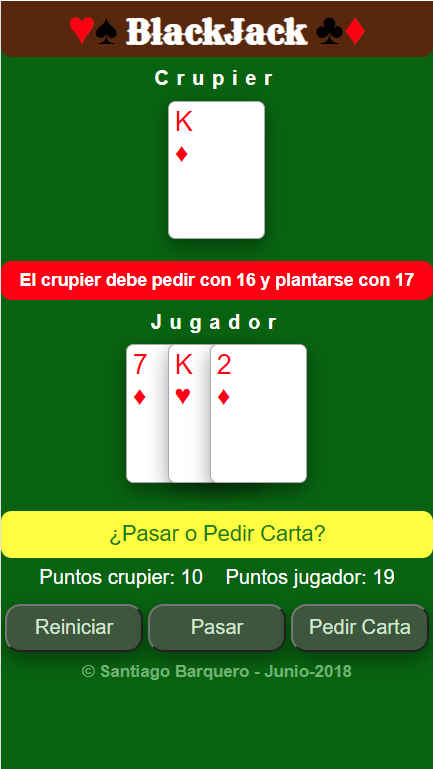

# Blackjack para navegador web

Juego de Blackjack simplificado para navegador web 

**Autor :** Santiago Barquero   **Fecha:** 08/06/2018

## Descripción
En este proyecto voy a desarrollar el juego de Blackjack simplificado para el navegador web, en el que el crupier va a jugar contra un solo jugador.

## Reglas del juego
A continuación expongo las **reglas simplificadas** para este proyecto, ya que las reales son más complejas.

El **objetivo del jugador** es conseguir una puntuación lo más cercana a 21 en sus cartas sin pasarse.

La **puntuación de las cartas** es el valor de su numeración, para aquellas que tienen número, 10 puntos para las figuras (J, D y K) y 11 puntos para el As.

La partida comienza con el crupier repartiendo dos cartas al jugador y una para él.
Tras el reparto inicial de cartas, el jugador tiene que decidir si se planta o pide más cartas.
Si el jugador va pidiendo cartas y se pasa de 21 puntos, acaba la partida.
Si el jugador se planta u obtiene una puntuación de 21, pasa el turno al crupier que tiene que coger cartas hasta llegar a 17 como mínimo.
Si el crupier supera los 21 pierde la partida, sino tiene que comparar su puntuación con la obtenida por el jugador.
El ganador es el que más se acerque a 21 sin pasarse.

## Desarrollo 
En la consola voy visualizando información para poder comprobar el correcto funcionamiento del juego y para poder entenderlo mejor. Los mensajes en consola incluye diversa información como por ejemplo: la función que se están ejecutando en ese momento, el contenido del array de barajas, los arrays de las manos del jugador y del crupier, sus puntuaciones, acciones, etc.

Voy a utilizar los siguientes tres objetos: Baraja, Crupier y Jugador. Aunque genero una baraja en cada inicio de la función y el crupier se queda con una copia que es la que el baraja y reparte.

## Versiones
v2 - Primera versión para Navegador "poco responsiva". Hago el desarrollo con HTML5, CSS3 y Javascript sin emplear ningún framework. Centro el diseño de esta primera prueba para una orientación vertical con una resolución de móvil de 412 x 652 pixeles.

## Puesta en marcha
Hay que lanzar el fichero **blackjack.html**.

## Bibliografía
Blackjack en Wikipedia - https://es.wikipedia.org/wiki/Blackjack

Video explicando reglas - https://www.youtube.com/watch?v=1aqWKlOaPpA
